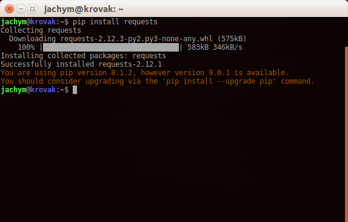
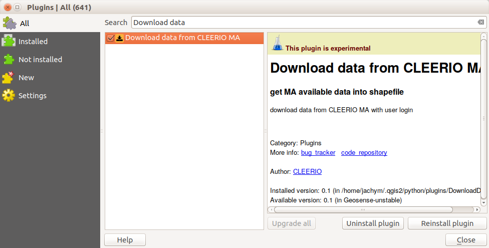
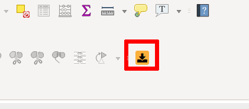

:orphan:

.. DownloadData documentation master file, created by
   sphinx-quickstart on Sun Feb 12 17:11:03 2012.
   You can adapt this file completely to your liking, but it should at least
   contain the root `toctree` directive.

Cleerio DownloadData zásuvný modul pro QGIS
###########################################

.. note:: Cleerio DownloadData QGIS zásuvný modul je zatím v ranné fázi vývoje.
    Zásuvný modul pouze stahuje data pro lokální použití a neprovádí žédné změny
    v databázi. 

    Pamatujte prosím, že se zásuvný modul může v budoucnu měnit a mohou se tím
    pádem zazézt chyby. Děkujeme, že nám pomáháte s testováním.

.. note:: Tento manuál vychází z anglického původního textu a zatím nebyl zcela
        přeložen.

Cleerio `DownloadData` QGIS Plugin is suited to be working with `QGIS
<http://qgis.org>`_ desktop GIS program. It's purpose is to download data from
`Cleerio API` to local harddrive and store it as `ESRI Shapefile` or `SQLite`
file for later usage.

Along with geometry data and attributes, attached files (images and documents)
are stored to local drive to and corresponding attributes are fixed, so that
they point to locally stored files.

Content:
    * :ref:`installation-cz`
    * :ref:`usage-cz`
    * :ref:`bugs-cz`

.. _installation-cz:

Instalace
=========

Požadavky
---------
* `QGIS <http://qgis.org>`_ 2.14 a novější
* `Python <http://python.org>`_ 2.7
* `Python requests module <https://pypi.python.org/pypi/requests/>`_
* `PIP <https://pypi.python.org/pypi/pip>`_ Python balíkovací nástroj manager 

MS Windows
----------

Ujistěte se, že je QGIS nainstalován pomocí instalátoru `OSGeo4W
<http://osgeo4w.osgeo.org/`_.

Nainstlujte **pip** Python package podle návodu https://trac.osgeo.org/osgeo4w/wiki/ExternalPythonPackages

Spusťte Windows příkazový řádek zmáčknutím `Win + R` a zadejte `cmd` do
dialogového okna  a stikněte tlačítko `OK`.

.. figure:: images/win-cmd.jpg

Pokračujte v příkazové řádce::

        curl https://bootstrap.pypa.io/get-pip.py -o get-pip.py
        python get-pip.py

Dále nainstalujte `requests` python module::

        pip install requests

.. figure:: images/pip-install-win.png

A spusťte QGIS.

Linux
-----
Use your Linux distribution package manager to download and install QGIS, like
`apt-get`::

    sudo apt-get install qgis

Start terminal and run::

    pip install requests

Run QGIS

In QGIS
-------
# Add Cleerio plugin repository - Open `Plugins --> Manage and install plugins` in new
window. Go to `Settings` tab and add new repository to **Plugin repositoires**
with Name: `Cleerio` and address `http://qgis.geosense.cz/geosense.xml`:

.. figure:: images/add_repo.png

And click `Reload all repositories`.

Now go to `All` tab and search for *Download data* string. Our plugin should
popup in front of you and you should be able to install it.

Once done, new icon should appear on your QGIS.

.. _usage-cz:

Použití
=======

1. Spusťte zásuvný modul kliknutím na patřičnou ikonu v liště

  .. figure:: images/download_data_icon.png

2. Zvolte doménu pro aplikace, pokud je máte, vyplňte  `Jméno` a `Heslo` 

3. Klikněte na tlačítko `Připojit`

  .. figure:: images/download_data_maname.png

4. You should be (after a while) able to select form available layers. Pick one,
  choose target directory and target layer name, consider, if you want to download
  the corresponding files or no.

  .. figure:: images/download_data_form.png

5. After clicking at `OK`, progress bar should be visible, indicating the
  progress

  .. figure:: images/progress_bar.png

6. After data are downloaded, they are loaded into the map automatically

  .. figure:: images/data_in_map.png

.. _bugs-cz:

Nahlášení problémů
==================

Pokud máte přístup do Cleerio Redmine https://redmine.geosense.cz/ zadejte nový
ticket.

V opačném případě kontaktujte svého lokálního distributora.
