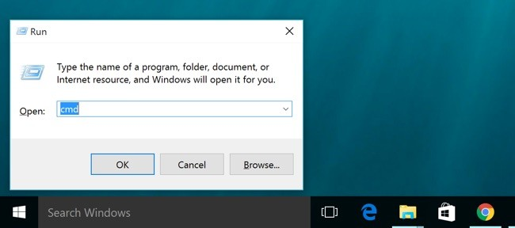
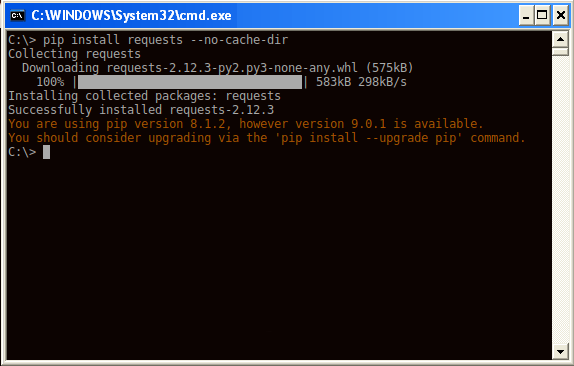
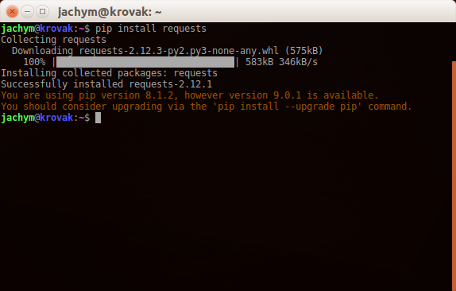
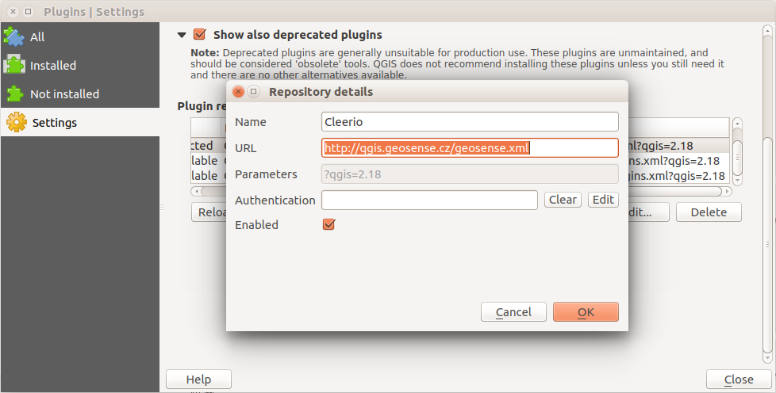
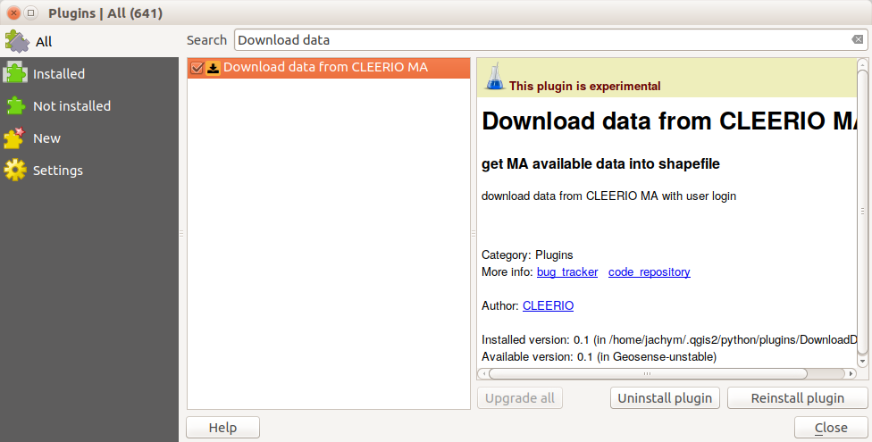
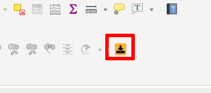

.. DownloadData documentation master file, created by
   sphinx-quickstart on Sun Feb 12 17:11:03 2012.
   You can adapt this file completely to your liking, but it should at least
   contain the root `toctree` directive.

Cleerio DownloadData plugin for QGIS
####################################

.. note:: Cleerio DownloadData QGIS plugin is still in early stage of
        development. The plugin is just downloading the data for local use,
        and is not providing any change to remote database.

        Please keep in mind, that the plugin can change in the future and that
        some bugs may occure. Thank you for helping us with testing.

Cleerio `DownloadData` QGIS Plugin is suited to be working with `QGIS
<http://qgis.org>`_ desktop GIS program. It's purpose is to download data from
`Cleerio API` to local harddrive and store it as `ESRI Shapefile` or `SQLite`
file for later usage.

Along with geometry data and attributes, attached files (images and documents)
are stored to local drive to and corresponding attributes are fixed, so that
they point to locally stored files.

Content:
    * :ref:`installation`
    * :ref:`usage`
    * :ref:`bugs`

.. _installation:

Installation
============

Requirements
------------
* `QGIS <http://qgis.org>`_ 2.14 and newer
* `Python <http://python.org>`_ 2.7
* `Python requests module <https://pypi.python.org/pypi/requests/>`_
* `PIP <https://pypi.python.org/pypi/pip>`_ Python package manager 

MS Windows
----------

Install QGIS and dependences
On Windows, make sure you install QGIS using `OSGeo4W
<http://osgeo4w.osgeo.org/`_ installator.

Install **pip** Python package manager as described https://trac.osgeo.org/osgeo4w/wiki/ExternalPythonPackages

Open Command line by pressing `Win + R` keys and type `cmd` in the dialog and
click on `OK` button.

Continue in the command line::

        curl https://bootstrap.pypa.io/get-pip.py -o get-pip.py
        python get-pip.py

Install `requests` python module::

        pip install requests

Run QGIS

Linux
-----
Use your Linux distribution package manager to download and install QGIS, like
`apt-get`::

    sudo apt-get install qgis

Start terminal and run::

    pip install requests

Run QGIS

In QGIS
-------
# Add Cleerio plugin repository - Open `Plugins --> Manage and install plugins` in new
window. Go to `Settings` tab and add new repository to **Plugin repositoires**
with Name: `Cleerio` and address `http://qgis.geosense.cz/geosense.xml`:

And click `Reload all repositories`.

Now go to `All` tab and search for *Download data* string. Our plugin should
popup in front of you and you should be able to install it.

Once done, new icon should appear on your QGIS.

.. _usage:

Usage
=====

1. Open the plugin by clicking at the icon

  .. figure:: images/download_data_icon.png

2. Choose Cleerio application domain, if you have them, fill also `User` and `Password` fields

3. Write down application name and click on `Connect`

  .. figure:: images/download_data_maname.png

4. You should be (after a while) able to select form available layers. Pick one,
  choose target directory and target layer name, consider, if you want to download
  the corresponding files or no.

  .. figure:: images/download_data_form.png

5. After clicking at `OK`, progress bar should be visible, indicating the
  progress

  .. figure:: images/progress_bar.png

6. After data are downloaded, they are loaded into the map automatically

  .. figure:: images/data_in_map.png

.. _bugs:

Report problems
===============

If you have access to Cleerio Redmine at https://redmine.geosense.cz/ fill the
ticket.

Otherwise please contact your local Cleerio Dealer
